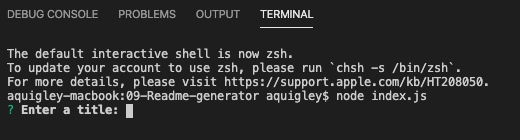
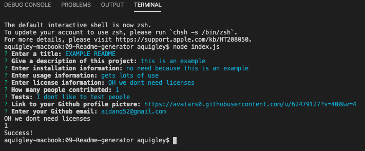
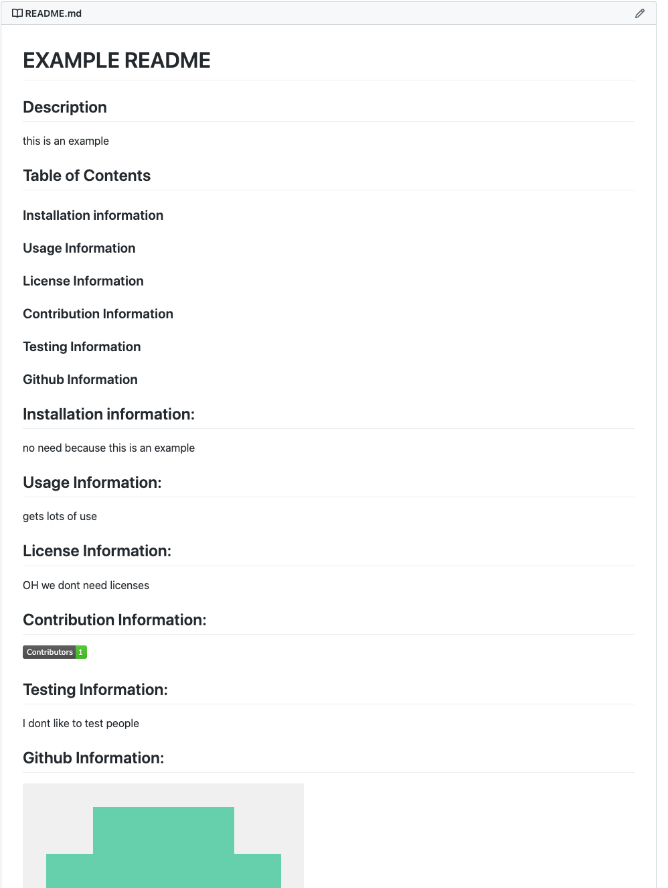

# Project 09 README: creating a README generator

## User Story:

```
AS A developer

I WANT a README generator

SO THAT I can easily put together a good README for a new project
```

## Description

This project was my first dive into the wonderful world of npm, terminal, javascript, and node. In this project I loaded and cashed three Javascript Modules: inquirer, fs, and generateMarkdown. GenerateMarkdown was a module I wrote with the help of my instructor and classmates that actually compiled the file. Inquirer is an npm package which provided the framework for an application that surved the user for information


## Screenshots:
1.) Calling the application

2.) Finishing the application

3.) the generated README

